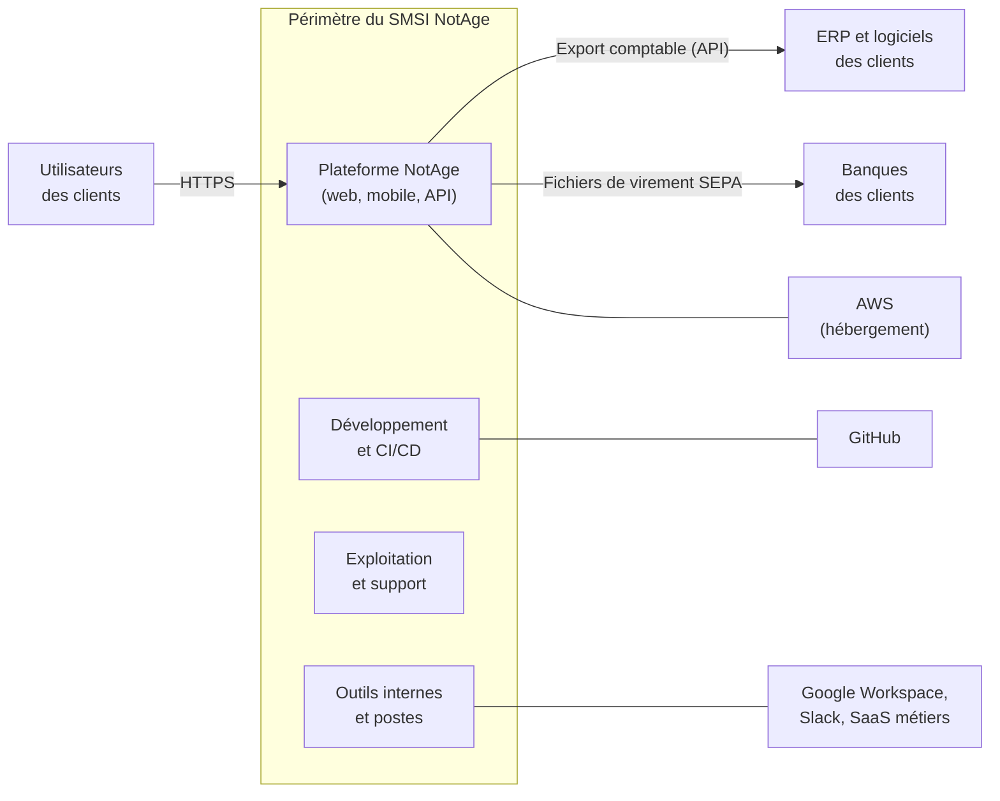
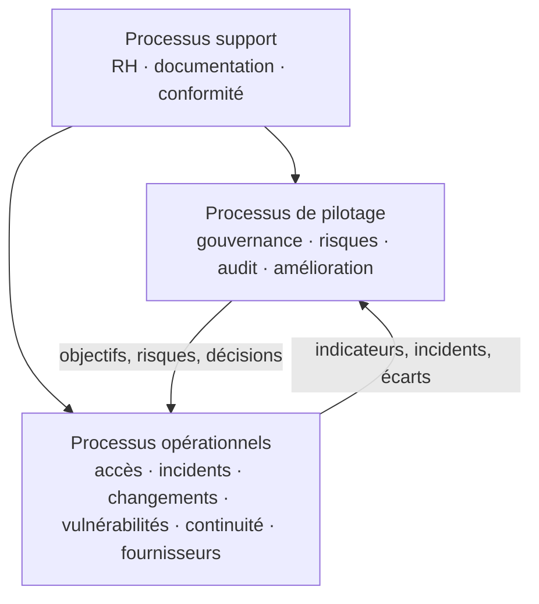

# Périmètre du SMSI

| Référence | Version | Date | Propriétaire | Approbateur | Classification | Statut |
|---|---|---|---|---|---|---|
| NTG-SMSI-CTX-003 | 1.0 | 27/09/2026 | RSSI | Direction générale (CEO) | Interne | Approuvé |

Exigences couvertes : ISO/IEC 27001:2022, articles 4.3 et 4.4.

## 1. Énoncé du périmètre

> Le système de management de la sécurité de l'information de NotAge couvre **la conception, le développement, l'hébergement, l'exploitation, la commercialisation et le support de la plateforme SaaS NotAge de gestion des dépenses professionnelles**, conformément à la déclaration d'applicabilité en vigueur.

C'est cet énoncé qui figurera sur le certificat.

## 2. Ce qui est inclus

| Dimension | Inclus |
|---|---|
| Activités | Toutes les activités de NotAge : développement, exploitation, support, vente, fonctions support et direction. Toutes contribuent au service ou manipulent des données clients. |
| Organisation | Les 50 salariés, ainsi que les prestataires et stagiaires ayant accès au système d'information |
| Sites | Les bureaux de Paris et les lieux de télétravail |
| Système d'information | La plateforme en production et hors production sur AWS, la chaîne de développement sur GitHub, les outils internes (Google Workspace, Slack, CRM, outil de support), les postes de travail et les smartphones utilisés pour accéder aux outils de l'entreprise |
| Informations | Données des clients et de leurs utilisateurs, code source, données internes (RH, finance, contrats) |

## 3. Ce qui est hors périmètre, et pourquoi

| Élément | Justification | Comment il est maîtrisé |
|---|---|---|
| Centres de données et infrastructure physique d'AWS | Hors du contrôle de NotAge : ils relèvent d'AWS selon le modèle de responsabilité partagée. | Gestion des fournisseurs : revue annuelle des certifications et rapports d'audit publiés par AWS (dont ISO 27001 et SOC 2), clauses contractuelles, suivi des incidents du fournisseur |
| Systèmes d'information des clients (ERP, logiciels comptables, banques) | Appartiennent aux clients | Sécurisation des interfaces : API authentifiées, flux chiffrés, responsabilités précisées dans les contrats |
| Infrastructure des éditeurs SaaS utilisés en interne | Hors du contrôle de NotAge | Gestion des fournisseurs, configuration sécurisée des comptes NotAge |

> **À retenir :** aucune activité de NotAge n'est exclue. Seul ce que NotAge ne contrôle pas est hors périmètre. Chacun de ces éléments est suivi comme une **interface** ou une **dépendance**, sans être ignoré.

## 4. Interfaces et dépendances

## 5. Processus du SMSI

L'article 4.4 demande d'établir le SMSI **avec ses processus et leurs interactions**. Ceux de NotAge sont les suivants.

| Famille | Processus | Pilote |
|---|---|---|
| Pilotage | Gouvernance et politique | Direction générale |
| Pilotage | Gestion des risques | RSSI |
| Pilotage | Mesure, audit interne et revue de direction | RSSI |
| Pilotage | Amélioration et actions correctives | RSSI |
| Opérationnel | Gestion des identités et des accès | Responsable infrastructure |
| Opérationnel | Gestion des incidents | RSSI |
| Opérationnel | Gestion des changements et développement sécurisé | CTO |
| Opérationnel | Gestion des vulnérabilités | Responsable infrastructure |
| Opérationnel | Sauvegarde et continuité d'activité | Responsable infrastructure |
| Opérationnel | Gestion des fournisseurs | CFO et RSSI |
| Support | Ressources humaines (arrivées, départs, sensibilisation) | Responsable RH |
| Support | Maîtrise documentaire | RSSI |
| Support | Conformité juridique et protection des données | DPO |

