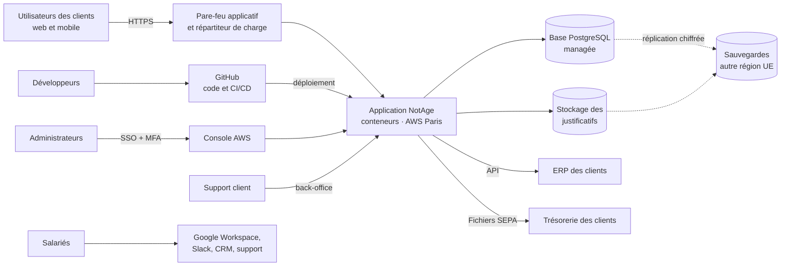

# Cartographie du SI et inventaire des actifs

| Référence | Version | Date | Propriétaire | Approbateur | Classification | Statut |
|---|---|---|---|---|---|---|
| NTG-SMSI-CTX-004 | 1.0 | 27/09/2026 | RSSI | CTO | Confidentiel | Approuvé |

Exigences couvertes : ISO/IEC 27001:2022, article 4.3 ; annexe A, mesure 5.9 (inventaire des informations et autres actifs associés). Vocabulaire de l'ISO/IEC 27005:2022.

## 1. Cartographie du système d'information

## 2. Échelle des besoins de sécurité

Chaque actif primordial reçoit un besoin en **disponibilité (D)**, **intégrité (I)** et **confidentialité (C)**, noté de 1 à 4. Cette échelle est reprise dans la méthodologie d'appréciation des risques.

| Niveau | Signification |
|---|---|
| 1 — Faible | Une atteinte n'aurait pas de conséquence notable. |
| 2 — Modéré | Une atteinte gênerait l'activité ou un client, sans conséquence durable. |
| 3 — Élevé | Une atteinte aurait des conséquences importantes : perte financière, manquement contractuel, plainte. |
| 4 — Critique | Une atteinte menacerait la relation avec les clients, exposerait à des sanctions ou mettrait en jeu la pérennité de l'entreprise. |

## 3. Actifs primordiaux

Les actifs primordiaux sont ce qui a de la valeur pour NotAge et ses clients : les informations et les activités métier.

| ID | Actif primordial | D | I | C | Justification des besoins |
|---|---|---|---|---|---|
| AP1 | Données personnelles des utilisateurs (identité, IBAN personnels, justificatifs) | 2 | 3 | **4** | Violation RGPD notifiable, atteinte à la vie privée de milliers de salariés, perte de confiance des clients |
| AP2 | Coordonnées bancaires des fournisseurs des clients | 2 | **4** | 3 | Une modification frauduleuse détourne directement des paiements |
| AP3 | Données comptables et financières des clients | 2 | 3 | 3 | Données sensibles des clients, erreurs de comptabilisation |
| AP4 | Service de gestion des dépenses (plateforme en ligne) | **3** | 3 | 2 | Engagement de disponibilité de 99,9 %, activité critique lors des clôtures mensuelles |
| AP5 | Génération des fichiers de paiement | 3 | **4** | 3 | Un fichier altéré entraîne des virements erronés ou frauduleux |
| AP6 | Code source et secrets techniques de la plateforme | 2 | **4** | **4** | Un code altéré compromet tous les clients ; des secrets divulgués ouvrent l'accès à la production |
| AP7 | Informations internes de NotAge (RH, contrats, finances) | 2 | 2 | 3 | Données personnelles des salariés, informations commerciales |

## 4. Actifs supports

Les actifs supports sont les éléments sur lesquels reposent les actifs primordiaux. Ce sont eux que les menaces visent et qui portent les vulnérabilités.

| ID | Actif support | Type | Propriétaire | Supporte |
|---|---|---|---|---|
| AS01 | Environnement de production AWS (conteneurs, base de données, stockage) | Infrastructure | Responsable infrastructure | AP1 à AP5 |
| AS02 | Sauvegardes (seconde région de l'UE) | Infrastructure | Responsable infrastructure | AP1 à AP5 |
| AS03 | Environnements hors production (recette, tests) | Infrastructure | CTO | AP6 |
| AS04 | Application NotAge (web, mobile, API, back-office) | Logiciel | CTO | AP1 à AP5 |
| AS05 | Dépôts de code et chaîne CI/CD (GitHub) | Logiciel et service | CTO | AP4, AP6 |
| AS06 | Identités et accès (SSO Google Workspace, comptes AWS, comptes à privilèges) | Service | Responsable infrastructure | Tous |
| AS07 | Messagerie et collaboration (Google Workspace, Slack) | Service | Responsable informatique interne | AP1, AP7 |
| AS08 | Outils SaaS métiers (CRM, outil de support) | Service | Responsable relation client | AP1, AP7 |
| AS09 | Ordinateurs portables | Matériel | Responsable informatique interne | Tous |
| AS10 | Smartphones personnels utilisés pour la messagerie | Matériel | Responsable informatique interne | AP7 |
| AS11 | Bureaux de Paris et réseau local | Site et réseau | Responsable services généraux | AP7 |
| AS12 | Équipe infrastructure et administrateurs | Personnes | CTO | Tous |
| AS13 | Équipe de développement | Personnes | CTO | AP6 |
| AS14 | Équipe support client (accès aux données clients) | Personnes | Responsable relation client | AP1 à AP3 |
| AS15 | Fournisseur d'hébergement AWS | Fournisseur | CFO et RSSI | AP4 |
| AS16 | Autres fournisseurs critiques (GitHub, Google, envoi d'e-mails transactionnels) | Fournisseurs | CFO et RSSI | AP4, AP6 |

> Le propriétaire d'un actif est responsable de sa protection au quotidien : il valide les accès et participe à l'analyse des risques qui le concernent. Ce rôle est distinct du propriétaire du risque, défini dans la méthodologie d'appréciation des risques.
