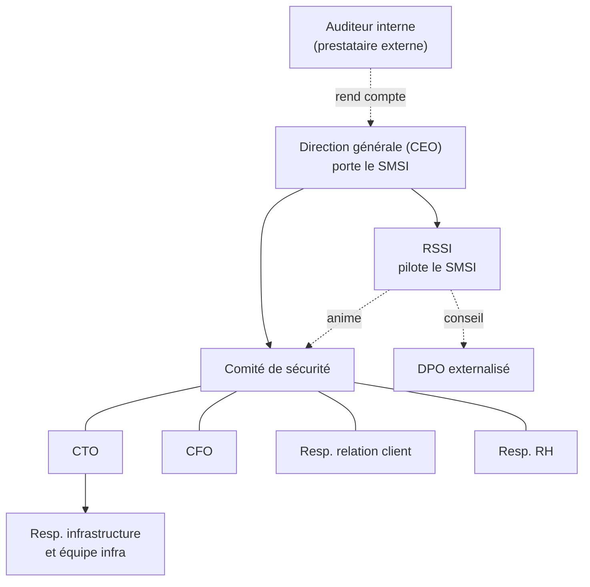

# Organisation de la sécurité et matrice RACI

| Référence | Version | Date | Propriétaire | Approbateur | Classification | Statut |
|---|---|---|---|---|---|---|
| NTG-SMSI-GOV-001 | 1.0 | 27/09/2026 | RSSI | Direction générale (CEO) | Interne | Approuvé |

Exigences couvertes : ISO/IEC 27001:2022, article 5.3 ; annexe A, mesures 5.2 (fonctions et responsabilités) et 5.3 (séparation des tâches).

## 1. Organigramme de la sécurité

## 2. Rôles et responsabilités

| Rôle | Responsabilités principales |
|---|---|
| **Direction générale (CEO)** | Approuve la politique, la PSSI, le périmètre et la DdA. Alloue les ressources. Accepte les risques résiduels les plus élevés. Préside la revue de direction. |
| **Comité de sécurité** | Composé du CEO, du CTO, du CFO, de la RSSI, du responsable relation client et de la responsable RH. Se réunit chaque mois pendant la mise en place du SMSI, puis chaque trimestre. Suit le plan de traitement des risques, les incidents et les indicateurs, et arbitre les priorités. |
| **RSSI** | Pilote le SMSI : appréciation des risques, DdA, PSSI, sensibilisation, indicateurs, gestion des incidents, relation avec l'organisme certificateur. Rattachée au CEO. |
| **CTO** | Propriétaire des risques techniques. Garant du développement sécurisé et de la gestion des changements. |
| **Responsable infrastructure** | Met en œuvre les mesures techniques : accès, sauvegardes, surveillance, correctifs, continuité. |
| **Responsable informatique interne** | Gère les postes de travail, les outils collaboratifs et les comptes des salariés. |
| **CFO** | Propriétaire des risques de fraude et des risques fournisseurs. Pilote les contrats et leurs clauses de sécurité. |
| **Responsable relation client** | Propriétaire des risques liés aux accès du support aux données clients. |
| **Responsable RH** | Gère les arrivées et les départs, la vérification des candidats et les clauses de confidentialité. |
| **DPO (externalisé)** | Conseille sur le RGPD, tient le registre des traitements, gère les violations de données avec la RSSI. |
| **Managers** | Valident les droits d'accès de leur équipe et relaient les règles de sécurité. |
| **Tous les salariés** | Appliquent la PSSI, suivent la sensibilisation et signalent tout événement suspect. |
| **Auditeur interne** | Prestataire externe qui réalise l'audit interne annuel et rend compte à la direction générale. |

## 3. Principes d'organisation

- **Indépendance de la RSSI.** Elle est rattachée au CEO et non au CTO, pour pouvoir alerter la direction sans conflit d'intérêts avec les équipes qui construisent la plateforme.
- **Séparation des tâches.** La RSSI n'administre pas la production. Les personnes qui développent ne déploient pas seules en production : chaque changement passe par une revue de code et une validation.
- **Impartialité de l'audit interne.** La RSSI ne peut pas auditer le système qu'elle pilote. L'audit interne est donc confié à un prestataire externe.
- **Propriétaires de risques identifiés.** Chaque risque a un propriétaire qui dispose de l'autorité et du budget nécessaires pour le traiter.

## 4. Matrice RACI

- **R** : réalise.
- **A** : approuve et rend des comptes. Il n'y a qu'un seul A par activité.
- **C** : consulté.
- **I** : informé.

| Activité | CEO | RSSI | CTO | Infra et IT interne | CFO | RH | DPO | Managers | Salariés |
|---|---|---|---|---|---|---|---|---|---|
| Rédiger la politique du SMSI et la PSSI | A | R | C | C | C | C | C | I | I |
| Définir le périmètre du SMSI | A | R | C | C | C | | | | |
| Apprécier les risques | I | A/R | C | C | C | | C | | |
| Valider le plan de traitement et accepter les risques résiduels | A | C | R | | R | | | | |
| Tenir la déclaration d'applicabilité | A | R | C | C | | | | | |
| Gérer les identités et les accès | | C | A | R | | C | | R | |
| Gérer les arrivées et les départs | | I | | R | | A | | R | |
| Signaler un événement de sécurité | | A | | | | | | R | R |
| Traiter un incident de sécurité | I | A | C | R | | | C | | |
| Notifier une violation de données à un client | A | C | | | | | R | | |
| Gérer les vulnérabilités et les correctifs | | C | A | R | | | | | |
| Sauvegardes et continuité d'activité | I | C | A | R | | | | | |
| Évaluer et suivre les fournisseurs | | R | C | | A | | C | | |
| Sensibiliser et former les salariés | | A/R | | | | R | | C | I |
| Mesurer les indicateurs du SMSI | I | A/R | C | C | | | | | |
| Organiser l'audit interne | A | R | C | C | | | | | |
| Conduire la revue de direction | A | R | C | | C | C | | | |
