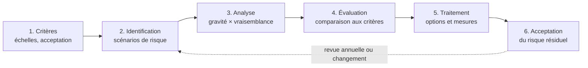

# Méthodologie d'appréciation et de traitement des risques

| Référence | Version | Date | Propriétaire | Approbateur | Classification | Statut |
|---|---|---|---|---|---|---|
| NTG-SMSI-RSK-001 | 1.0 | 27/09/2026 | RSSI | Direction générale (CEO) | Interne | Approuvé |

Exigences couvertes : ISO/IEC 27001:2022, articles 6.1.2, 6.1.3, 8.2 et 8.3. Méthode : ISO/IEC 27005:2022.

## 1. Objet

Ce document décrit comment NotAge identifie, analyse, évalue et traite ses risques de sécurité de l'information. Il fixe des critères stables pour que chaque appréciation produise des résultats **cohérents, valides et comparables** d'une année sur l'autre (article 6.1.2 b).

## 2. Vue d'ensemble du processus

Deux activités accompagnent tout le processus. La **communication et la consultation** passent par des ateliers avec les propriétaires des risques et par la présentation en comité de sécurité. La **surveillance et la revue** se font par le suivi des indicateurs et des incidents, et par la réappréciation périodique.

## 3. Approche retenue

ISO/IEC 27005:2022 propose deux approches pour identifier les risques. NotAge les combine.

| Approche | Principe | Usage chez NotAge |
|---|---|---|
| **Par les événements** | Partir des sources de risque (qui ou quoi pourrait nuire) et des événements redoutés sur les actifs primordiaux | Construire des **scénarios** réalistes et compréhensibles par la direction |
| **Par les actifs** | Partir des actifs supports, de leurs menaces et de leurs vulnérabilités | Détailler chaque scénario et relier ses vulnérabilités aux mesures de l'annexe A |

Un **scénario de risque** décrit donc une histoire complète : une source de risque, qui exploite des vulnérabilités d'actifs supports, pour atteindre la disponibilité, l'intégrité ou la confidentialité d'actifs primordiaux, avec des conséquences pour NotAge et ses clients.

## 4. Identification

**Données d'entrée**

- L'inventaire des actifs et leurs besoins de sécurité (NTG-SMSI-CTX-004).
- Le constat de sécurité initial (NTG-SMSI-CTX-001, section 6).
- Les enjeux et les exigences des parties intéressées (NTG-SMSI-CTX-002).
- L'état de la menace publié par l'ANSSI et le CERT-FR.
- Les incidents passés et le rapport du test d'intrusion de 2025.

**Sources de risque considérées**

- Cybercriminels : rançongiciel, vol de données, fraude au virement.
- Salariés malveillants ou manipulés.
- Erreurs internes.
- Fournisseurs compromis ou défaillants.
- Autorités étatiques étrangères.
- Événements accidentels ou climatiques.

**Contenu d'un scénario**

Pour chaque scénario, on renseigne :

- la source de risque ;
- la description du scénario ;
- les actifs primordiaux et supports concernés ;
- le critère atteint (D, I, C) ;
- les vulnérabilités exploitées ;
- les mesures existantes ;
- le propriétaire du risque.

## 5. Analyse

Chaque scénario est évalué en tenant compte des **mesures existantes** : on obtient le **risque initial**.

### Échelle de gravité (G)

La gravité retenue est la plus élevée parmi les quatre dimensions.

| Niveau | Financier | Clients et contrats | Juridique et réglementaire | Image et opérations |
|---|---|---|---|---|
| **1 — Mineure** | < 10 k€ | Aucun client affecté de façon notable | Aucune conséquence | Gêne interne |
| **2 — Significative** | 10 à 100 k€ | Quelques clients gênés, interruption < 4 h hors clôture | Aucune notification requise | Mécontentement ponctuel |
| **3 — Grave** | 100 k€ à 1 M€ | Plusieurs clients affectés, interruption de 4 à 24 h ou en clôture, manquement contractuel | Violation de données notifiable de portée limitée | Plaintes, médiatisation locale |
| **4 — Critique** | > 1 M€ | Perte d'un client majeur, interruption > 24 h | Violation massive, sanction de la CNIL | Atteinte durable à la réputation, pérennité menacée |

### Échelle de vraisemblance (V)

| Niveau | Définition |
|---|---|
| **1 — Peu vraisemblable** | Source peu motivée ou peu capable, mesures existantes solides. Non attendu sur les trois prochaines années. |
| **2 — Vraisemblable** | Déjà observé dans le secteur, mais suppose des moyens ou des circonstances particuliers. Possible sur trois ans. |
| **3 — Très vraisemblable** | Menace active contre ce type d'entreprise, vulnérabilités connues, peu de mesures. Attendu dans l'année. |
| **4 — Quasi certain** | Se produit déjà, ou plusieurs fois par an. |

> **Pourquoi quatre niveaux ?** Un nombre pair évite le niveau « moyen » refuge : chaque évaluation oblige à trancher.

### Niveau de risque

**Niveau = G × V**, de 1 à 16.

| V \ G | 1 | 2 | 3 | 4 |
|---|---|---|---|---|
| **4** | 🟨 4 | 🟧 8 | 🟥 12 | 🟥 16 |
| **3** | 🟩 3 | 🟨 6 | 🟧 9 | 🟥 12 |
| **2** | 🟩 2 | 🟨 4 | 🟨 6 | 🟧 8 |
| **1** | 🟩 1 | 🟩 2 | 🟩 3 | 🟨 4 |

Ce produit sert à **classer** les risques, pas à les mesurer : les échelles sont ordinales. Deux risques de même niveau se départagent par la gravité, puis par le jugement du comité de sécurité.

## 6. Évaluation et critères d'acceptation

| Niveau | Zone | Décision attendue | Qui peut accepter le risque résiduel |
|---|---|---|---|
| 12 à 16 | 🟥 Critique | Traitement prioritaire obligatoire, plan d'action sous 3 mois | Non acceptable en l'état |
| 8 à 9 | 🟧 Élevé | Traitement requis, plan d'action sous 6 mois | Direction générale uniquement, avec justification écrite |
| 4 à 6 | 🟨 Modéré | Traitement si le coût est raisonnable, sinon acceptation | Propriétaire du risque |
| 1 à 3 | 🟩 Faible | Acceptation, surveillance lors de la revue annuelle | Propriétaire du risque |

**Critère d'acceptation cible** : tout risque résiduel doit être au plus Modéré, ou Élevé avec l'acceptation écrite de la direction générale.

## 7. Traitement

**Options de traitement (ISO/IEC 27005:2022)**

| Option | Principe | Exemple |
|---|---|---|
| **Réduire** | Mettre en place des mesures qui diminuent la vraisemblance ou la gravité | Imposer l'authentification multifacteur |
| **Accepter** | Conserver le risque en connaissance de cause | Risque faible, ou coût de traitement disproportionné |
| **Éviter** | Supprimer l'activité ou la situation à l'origine du risque | Renoncer à stocker une donnée inutile |
| **Partager** | Transférer une partie des conséquences à un tiers | Assurance cyber, clauses contractuelles |

**Étapes du traitement**

1. **Choix des mesures.** On détermine les mesures nécessaires, puis on les compare à l'annexe A d'ISO/IEC 27001 pour vérifier qu'aucune mesure nécessaire n'a été oubliée (article 6.1.3 c).
2. **Déclaration d'applicabilité.** Les mesures retenues alimentent la DdA (NTG-SMSI-DDA-001).
3. **Plan de traitement.** Le plan (NTG-SMSI-RSK-004) précise pour chaque mesure le responsable, l'échéance, les ressources et le risque résiduel visé.
4. **Approbation et acceptation.** Les propriétaires des risques approuvent le plan et acceptent les risques résiduels selon les critères de la section 6 (article 6.1.3 f).

## 8. Propriétaires des risques

Le propriétaire d'un risque est la personne qui dispose de l'**autorité et du budget** pour le traiter. Ce n'est pas la RSSI : elle anime la démarche, conseille et consolide, mais ne décide pas à la place des métiers.

| Propriétaire | Risques concernés |
|---|---|
| CTO | Risques techniques : production, application, chaîne de développement, continuité, terminaux |
| CFO | Fraude, fournisseurs, engagements contractuels |
| Responsable relation client | Accès du support aux données clients |
| Responsable RH | Arrivées et départs |
| Direction générale | Risques transverses (facteur humain) et stratégiques (souveraineté) |

## 9. Fréquence et traçabilité

- **Quand l'appréciation est-elle refaite ?** Au moins une fois par an, et à chaque changement significatif (article 8.2) :
  - nouveau type de client ou nouvelle fonctionnalité sensible ;
  - fournisseur critique supplémentaire ;
  - incident majeur ;
  - évolution réglementaire, comme l'entrée en vigueur de NIS2.
- **Où sont conservés les résultats ?** Dans le registre des risques (NTG-SMSI-RSK-002) et le rapport d'analyse (NTG-SMSI-RSK-003). Ce sont des enregistrements conservés au moins trois ans (articles 8.2 et 8.3).
