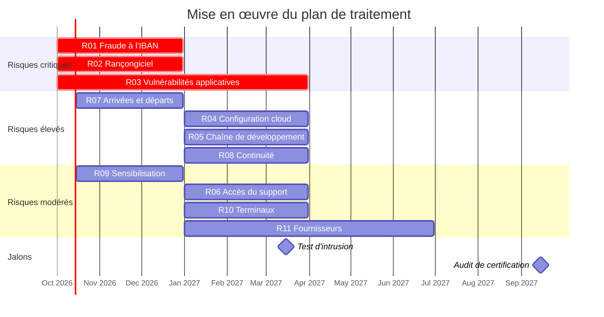

# Plan de traitement des risques

| Référence | Version | Date | Propriétaire | Approbateur | Classification | Statut |
|---|---|---|---|---|---|---|
| NTG-SMSI-RSK-004 | 1.0 | 27/09/2026 | RSSI | Direction générale (CEO) | Confidentiel | Approuvé |

Exigences couvertes : ISO/IEC 27001:2022, articles 6.1.3 et 8.3. Méthode : [NTG-SMSI-RSK-001](01-methodologie-risques.md). Registre : [NTG-SMSI-RSK-002](02-registre-risques.md).

## 1. Synthèse

Le plan traite les **12 scénarios de risque** de l'appréciation de septembre 2026 avec **28 mesures de l'annexe A**, choisies pour agir sur les cinq causes racines identifiées dans le [rapport d'analyse](03-rapport-analyse-risques.md). Une même mesure traite souvent plusieurs scénarios : c'est ce qui permet de rester à 28.

| Zone | Avant traitement | Après traitement |
|---|---|---|
| 🟥 Critique | 3 | 0 |
| 🟧 Élevé | 4 | 1 |
| 🟨 Modéré | 4 | 6 |
| 🟩 Faible | 1 | 5 |

**Ce que le plan obtient**

- **Plus aucun risque critique.**
- **Un seul risque élevé subsiste : R03.** Une application exposée sur Internet garde un risque de vulnérabilité qu'aucune mesure ne supprime totalement. Son risque résiduel est **accepté par écrit par la direction générale** jusqu'au test d'intrusion de mars 2027, conformément aux critères d'acceptation.
- **Tous les autres risques sont modérés ou faibles**, et acceptés par leurs propriétaires.

| Avant | Après |
|---|---|
|  |  |

## 2. Vue d'ensemble par scénario

| ID | Scénario | Initial | Option | Mesures de l'annexe A | Échéance | Résiduel |
|---|---|---|---|---|---|---|
| R01 | Détournement de paiements par modification frauduleuse d'un IBAN fournisseur | 🟥 12 | Réduire | 8.26, 8.5, 8.15, 8.16 | 31/12/2026 | 🟨 4 |
| R02 | Chiffrement ou destruction de la production par rançongiciel après compromission d'un compte administrateur AWS | 🟥 12 | Réduire et partager | 8.2, 5.18, 8.5, 8.13, 8.16, 5.24, 5.26 | 31/12/2026 | 🟨 6 |
| R03 | Vol massif de données par exploitation d'une vulnérabilité de l'application | 🟥 12 | Réduire | 8.8, 8.28, 8.29 | 31/12/2026 (corrections), 31/03/2027 (outillage) | 🟧 8 |
| R04 | Exposition publique de justificatifs par erreur de configuration du stockage cloud | 🟧 8 | Réduire | 8.9, 5.23, 8.16 | 31/03/2027 | 🟨 4 |
| R05 | Injection de code malveillant ou vol de secrets via la chaîne de développement | 🟧 8 | Réduire | 8.4, 5.17, 8.32, 8.28 | 31/03/2027 | 🟨 4 |
| R06 | Consultation ou modification abusive de données clients par un membre du support | 🟨 6 | Réduire | 8.3, 8.11, 8.15 | 31/03/2027 | 🟩 3 |
| R07 | Utilisation du compte d'un ancien salarié resté actif | 🟧 9 | Réduire | 5.16, 5.18, 6.5 | 31/12/2026 | 🟩 3 |
| R08 | Interruption prolongée du service en période de clôture comptable | 🟧 9 | Réduire | 5.30, 8.13, 8.32 | 31/03/2027 | 🟨 4 |
| R09 | Compromission d'un compte de messagerie par hameçonnage ciblé | 🟨 6 | Réduire | 6.3, 6.8 | 31/12/2026 | 🟨 4 |
| R10 | Perte ou vol d'un ordinateur portable ou d'un smartphone personnel | 🟨 6 | Réduire | 8.1, 7.9 | 31/03/2027 | 🟩 3 |
| R11 | Fuite de données clients via un fournisseur SaaS compromis | 🟨 6 | Réduire | 5.19, 5.20 | 30/06/2027 | 🟩 3 |
| R12 | Accès aux données par une autorité étrangère via l'hébergeur (Cloud Act) | 🟩 3 | Accepter | — | Revue annuelle | 🟩 3 |

## 3. Détail du traitement

### R01 — Détournement de paiements par modification frauduleuse d'un IBAN fournisseur

**Initial :** 🟥 12 (G4 × V3)  →  **Résiduel visé :** 🟨 4 (G4 × V1) · **Option :** Réduire · **Propriétaire :** CFO

**Actions**

- Double validation de toute modification d'IBAN par deux utilisateurs distincts du client, avec notification au fournisseur et à l'administrateur du client (8.26)
- Authentification multifacteur obligatoire pour les rôles administrateur et valideur des clients, réauthentification avant toute action sensible (8.5)
- Journal inaltérable des modifications de coordonnées bancaires : auteur, date, ancienne et nouvelle valeur (8.15)
- Détection des comportements anormaux (connexion inhabituelle suivie d'un changement d'IBAN) avec alerte au client et au support (8.16)

| Responsable | Échéance | Ressources | Acceptation du risque résiduel |
|---|---|---|---|
| CTO | 31/12/2026 | Développement : environ 25 jours-homme | Acceptée par le CFO |

### R02 — Chiffrement ou destruction de la production par rançongiciel après compromission d'un compte administrateur AWS

**Initial :** 🟥 12 (G4 × V3)  →  **Résiduel visé :** 🟨 6 (G3 × V2) · **Option :** Réduire et partager · **Propriétaire :** CTO

**Actions**

- Deux administrateurs permanents seulement, élévation temporaire de privilèges sur demande, suppression des clés d'accès de longue durée (8.2)
- Revue trimestrielle des droits d'accès à l'environnement AWS (5.18)
- Clés de sécurité physiques pour tous les comptes à privilèges (8.5)
- Sauvegardes chiffrées et immuables dans un compte AWS séparé, test de restauration chaque trimestre (8.13)
- Journalisation centralisée et alertes sur les actions sensibles : suppression, modification des droits (8.16)
- Procédure de gestion des incidents et exercice annuel de crise rançongiciel (5.24, 5.26)
- Partage : l'assurance cyber couvre une partie des pertes d'exploitation et des frais de réponse

| Responsable | Échéance | Ressources | Acceptation du risque résiduel |
|---|---|---|---|
| Responsable infrastructure | 31/12/2026 | Infrastructure : environ 20 jours-homme ; clés de sécurité : environ 1 k€ | Acceptée par le CTO |

### R03 — Vol massif de données par exploitation d'une vulnérabilité de l'application

**Initial :** 🟥 12 (G4 × V3)  →  **Résiduel visé :** 🟧 8 (G4 × V2) · **Option :** Réduire · **Propriétaire :** CTO

**Actions**

- Correction de toutes les vulnérabilités critiques et élevées du test d'intrusion de 2025 avant fin 2026, puis délais de correction par criticité : 15 jours pour les critiques, 30 jours pour les élevées (8.8)
- Règles de codage sécurisé fondées sur l'OWASP, formation annuelle des développeurs, contrôle des dépendances (8.28)
- Analyse automatique du code et des dépendances dans la CI, test d'intrusion annuel ciblant le cloisonnement entre clients (8.29)

| Responsable | Échéance | Ressources | Acceptation du risque résiduel |
|---|---|---|---|
| CTO | 31/12/2026 (corrections), 31/03/2027 (outillage) | Développement : environ 30 jours-homme ; test d'intrusion : environ 15 k€ par an | Risque résiduel élevé accepté par écrit par la direction générale jusqu'au test d'intrusion de mars 2027 |

### R04 — Exposition publique de justificatifs par erreur de configuration du stockage cloud

**Initial :** 🟧 8 (G4 × V2)  →  **Résiduel visé :** 🟨 4 (G4 × V1) · **Option :** Réduire · **Propriétaire :** CTO

**Actions**

- Infrastructure décrite en code, configurations de référence (blocage de l'accès public, chiffrement), revue de chaque changement (8.9)
- Règles d'utilisation d'AWS : responsabilité partagée, services autorisés, contrôle continu de la posture de sécurité (5.23)
- Alerte immédiate en cas d'exposition publique d'une ressource (8.16)

| Responsable | Échéance | Ressources | Acceptation du risque résiduel |
|---|---|---|---|
| Responsable infrastructure | 31/03/2027 | Infrastructure : environ 15 jours-homme | Acceptée par le CTO |

### R05 — Injection de code malveillant ou vol de secrets via la chaîne de développement

**Initial :** 🟧 8 (G4 × V2)  →  **Résiduel visé :** 🟨 4 (G4 × V1) · **Option :** Réduire · **Propriétaire :** CTO

**Actions**

- Authentification multifacteur obligatoire sur GitHub, accès au code selon le besoin, branches protégées (8.4)
- Retrait des secrets du code, stockage dans un coffre, rotation des secrets exposés, détection automatique dans la CI (5.17)
- Déploiement en production uniquement par la CI, après validation d'une seconde personne (8.32)
- Contrôle des dépendances et des actions tierces utilisées dans la CI (8.28)

| Responsable | Échéance | Ressources | Acceptation du risque résiduel |
|---|---|---|---|
| CTO | 31/03/2027 | Développement et infrastructure : environ 12 jours-homme | Acceptée par le CTO |

### R06 — Consultation ou modification abusive de données clients par un membre du support

**Initial :** 🟨 6 (G3 × V2)  →  **Résiduel visé :** 🟩 3 (G3 × V1) · **Option :** Réduire · **Propriétaire :** Responsable relation client

**Actions**

- Accès du support limité aux comptes des clients ayant ouvert une demande (8.3)
- IBAN masqués dans le back-office, seuls les quatre derniers caractères visibles (8.11)
- Journalisation des consultations et revue mensuelle par échantillonnage (8.15)

| Responsable | Échéance | Ressources | Acceptation du risque résiduel |
|---|---|---|---|
| CTO | 31/03/2027 | Développement : environ 10 jours-homme | Acceptée par le responsable relation client |

### R07 — Utilisation du compte d'un ancien salarié resté actif

**Initial :** 🟧 9 (G3 × V3)  →  **Résiduel visé :** 🟩 3 (G3 × V1) · **Option :** Réduire · **Propriétaire :** Responsable RH

**Actions**

- Procédure d'arrivée et de départ avec la liste des accès par profil, tous les outils raccordés au SSO, désactivation le jour du départ (5.16)
- Revue trimestrielle des comptes et des droits (5.18)
- Rappel écrit des obligations de confidentialité et restitution du matériel au départ (6.5)

| Responsable | Échéance | Ressources | Acceptation du risque résiduel |
|---|---|---|---|
| Responsable RH et responsable informatique interne | 31/12/2026 | Interne : environ 5 jours-homme | Acceptée par la responsable RH |

### R08 — Interruption prolongée du service en période de clôture comptable

**Initial :** 🟧 9 (G3 × V3)  →  **Résiduel visé :** 🟨 4 (G2 × V2) · **Option :** Réduire · **Propriétaire :** CTO

**Actions**

- Objectifs de reprise fixés (reprise en 4 heures, perte de données d'une heure au plus), plan de reprise testé chaque année (5.30)
- Tests de restauration trimestriels (8.13, mesure partagée avec R02)
- Plan de retour arrière obligatoire, gel des mises en production majeures pendant les clôtures, déploiements progressifs (8.32)

| Responsable | Échéance | Ressources | Acceptation du risque résiduel |
|---|---|---|---|
| CTO | 31/03/2027 | Infrastructure : environ 10 jours-homme | Acceptée par le CTO |

### R09 — Compromission d'un compte de messagerie par hameçonnage ciblé

**Initial :** 🟨 6 (G3 × V2)  →  **Résiduel visé :** 🟨 4 (G2 × V2) · **Option :** Réduire · **Propriétaire :** Direction générale (CEO)

**Actions**

- Sensibilisation à l'arrivée puis annuelle, campagnes trimestrielles d'hameçonnage simulé (6.3)
- Canal de signalement unique (bouton dans la messagerie et canal Slack dédié) et réponse de la RSSI sous 1 heure ouvrée (6.8)

| Responsable | Échéance | Ressources | Acceptation du risque résiduel |
|---|---|---|---|
| RSSI | 31/12/2026 | Plateforme de simulation : environ 3 k€ par an | Acceptée par la direction générale |

### R10 — Perte ou vol d'un ordinateur portable ou d'un smartphone personnel

**Initial :** 🟨 6 (G2 × V3)  →  **Résiduel visé :** 🟩 3 (G1 × V3) · **Option :** Réduire · **Propriétaire :** CTO

**Actions**

- Gestion centralisée des portables (chiffrement vérifié, verrouillage, effacement à distance) et accès mobile uniquement via un profil professionnel protégé (8.1)
- Règles pour les déplacements et déclaration de toute perte sous 24 heures (7.9)

| Responsable | Échéance | Ressources | Acceptation du risque résiduel |
|---|---|---|---|
| Responsable informatique interne | 31/03/2027 | Outil de gestion des terminaux : environ 4 k€ par an | Acceptée par le CTO |

### R11 — Fuite de données clients via un fournisseur SaaS compromis

**Initial :** 🟨 6 (G3 × V2)  →  **Résiduel visé :** 🟩 3 (G3 × V1) · **Option :** Réduire · **Propriétaire :** CFO

**Actions**

- Classement des fournisseurs par criticité, évaluation de sécurité avant contrat puis chaque année pour les critiques (5.19)
- Clauses de sécurité : notification des incidents sous 48 heures, localisation des données dans l'UE, droit d'audit, réversibilité (5.20)

| Responsable | Échéance | Ressources | Acceptation du risque résiduel |
|---|---|---|---|
| CFO et RSSI | 30/06/2027 | Interne : environ 8 jours-homme | Acceptée par le CFO |

### R12 — Accès aux données par une autorité étrangère via l'hébergeur (Cloud Act)

**Initial :** 🟩 3 (G3 × V1)  →  **Résiduel visé :** 🟩 3 (G3 × V1) · **Option :** Accepter · **Propriétaire :** Direction générale (CEO)

**Actions**

- Aucune nouvelle mesure : risque faible, conforme aux critères d'acceptation
- Réponse type préparée pour les clients qui posent la question ; gestion des clés de chiffrement par NotAge étudiable si un client l'exige

| Responsable | Échéance | Ressources | Acceptation du risque résiduel |
|---|---|---|---|
| Direction générale | Revue annuelle | Aucune | Acceptée par la direction générale |

## 4. Les 28 mesures prioritaires

| Mesure | Intitulé | Scénarios traités |
|---|---|---|
| **5.16** | Gestion des identités | R07 |
| **5.17** | Informations d'authentification | R05 |
| **5.18** | Droits d'accès | R02, R07 |
| **5.19** | Sécurité de l'information dans les relations avec les fournisseurs | R11 |
| **5.20** | Sécurité de l'information dans les accords avec les fournisseurs | R11 |
| **5.23** | Sécurité de l'information dans l'utilisation de services en nuage | R04 |
| **5.24** | Planification et préparation de la gestion des incidents | R02 |
| **5.26** | Réponse aux incidents de sécurité de l'information | R02 |
| **5.30** | Préparation des TIC pour la continuité d'activité | R08 |
| **6.3** | Sensibilisation, enseignement et formation | R09 |
| **6.5** | Responsabilités après la fin ou la modification du contrat | R07 |
| **6.8** | Déclaration des événements de sécurité de l'information | R09 |
| **7.9** | Sécurité des actifs hors des locaux | R10 |
| **8.1** | Terminaux des utilisateurs | R10 |
| **8.2** | Droits d'accès privilégiés | R02 |
| **8.3** | Restriction d'accès aux informations | R06 |
| **8.4** | Accès au code source | R05 |
| **8.5** | Authentification sécurisée | R01, R02 |
| **8.8** | Gestion des vulnérabilités techniques | R03 |
| **8.9** | Gestion des configurations | R04 |
| **8.11** | Masquage des données | R06 |
| **8.13** | Sauvegarde des informations | R02, R08 |
| **8.15** | Journalisation | R01, R06 |
| **8.16** | Activités de surveillance | R01, R02, R04 |
| **8.26** | Exigences de sécurité des applications | R01 |
| **8.28** | Codage sécurisé | R03, R05 |
| **8.29** | Tests de sécurité dans le développement et l'acceptation | R03 |
| **8.32** | Gestion des changements | R05, R08 |

**Répartition par thème**

- 9 mesures organisationnelles ;
- 3 liées aux personnes ;
- 1 physique ;
- 15 technologiques.

**La plus structurante** est 8.16 (activités de surveillance), qui traite trois scénarios : R01, R02 et R04. Sept autres mesures en traitent chacune deux.

La DdA ([NTG-SMSI-DDA-001](../03-dda/declaration-applicabilite.md)) examine les 93 mesures de l'annexe A. Les 28 mesures ci-dessus sont celles que l'analyse de risques rend prioritaires.

## 5. Calendrier

Les délais respectent les critères d'acceptation : traitement sous trois mois pour les risques critiques, et sous six mois pour les risques élevés.

## 6. Suivi et acceptation

- **Suivi mensuel.** L'avancement est suivi en comité de sécurité chaque mois, à partir des indicateurs de NTG-SMSI-PIL-001.
- **Réévaluation.** Chaque risque est réévalué quand ses mesures sont en place. Le registre est alors mis à jour avec le niveau résiduel constaté.
- **Acceptation formelle.** Les risques résiduels ci-dessous ont été acceptés par leurs propriétaires lors du comité de sécurité du 27 septembre 2026.

| Risque | Niveau résiduel | Accepté par |
|---|---|---|
| R01 | 🟨 4 Modéré | Acceptée par le CFO |
| R02 | 🟨 6 Modéré | Acceptée par le CTO |
| R03 | 🟧 8 Élevé | Risque résiduel élevé accepté par écrit par la direction générale jusqu'au test d'intrusion de mars 2027 |
| R04 | 🟨 4 Modéré | Acceptée par le CTO |
| R05 | 🟨 4 Modéré | Acceptée par le CTO |
| R06 | 🟩 3 Faible | Acceptée par le responsable relation client |
| R07 | 🟩 3 Faible | Acceptée par la responsable RH |
| R08 | 🟨 4 Modéré | Acceptée par le CTO |
| R09 | 🟨 4 Modéré | Acceptée par la direction générale |
| R10 | 🟩 3 Faible | Acceptée par le CTO |
| R11 | 🟩 3 Faible | Acceptée par le CFO |
| R12 | 🟩 3 Faible | Acceptée par la direction générale |
