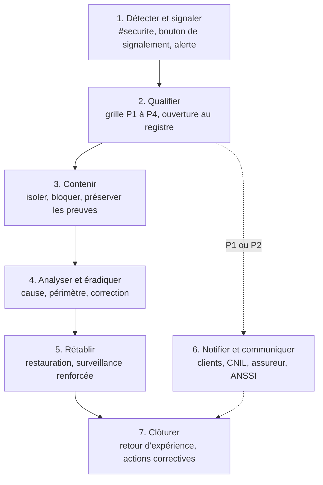

# Procédure de gestion des incidents de sécurité

| Référence | Version | Date | Propriétaire | Approbateur | Classification | Statut |
|---|---|---|---|---|---|---|
| NTG-SMSI-PRC-001 | 1.0 | 27/09/2026 | RSSI | RSSI, après avis du CTO | Interne | Approuvé |

Exigences couvertes : ISO/IEC 27001:2022, annexe A, mesures 5.5, 5.24 à 5.28 et 6.8. Règles de référence : PSSI, section 10 (INC-01 à INC-06). Scénarios traités en priorité : R01, R02, R03, R04, R09, R11.

## 1. Objet

Cette procédure décrit comment NotAge détecte, qualifie, traite et clôture un incident de sécurité, et qui doit être prévenu, dans quels délais. Elle vise trois objectifs :

- **limiter les conséquences** pour les clients et pour NotAge ;
- **respecter les obligations de notification** (RGPD, contrats clients dont les clauses issues de DORA, et NIS2 si elle devient applicable) ;
- **tirer des enseignements** de chaque incident significatif.

## 2. Définitions

| Terme | Définition |
|---|---|
| Événement de sécurité | Situation qui pourrait signaler une atteinte à la sécurité : e-mail suspect, alerte technique, appareil perdu. |
| Incident de sécurité | Événement qui porte, ou risque de porter, atteinte à la disponibilité, à l'intégrité ou à la confidentialité de l'information. |
| Incident majeur | Incident de gravité P1 ou P2 selon la grille de la section 4. |
| Violation de données | Incident qui entraîne la perte, l'altération, la divulgation ou l'accès non autorisé à des données personnelles. |

## 3. Rôles

| Rôle | Responsabilités |
|---|---|
| **Tout collaborateur** | Signale sans délai tout événement suspect, sans chercher à enquêter lui-même. Ne supprime rien. |
| **RSSI** | Coordonne le traitement : qualifie, décide des mesures, tient le registre, anime le retour d'expérience. Suppléant : CTO. |
| **Astreinte infrastructure** | Disponible jour et nuit. Reçoit les alertes techniques, applique les premières mesures de confinement. |
| **Cellule de crise** | Réunie pour tout incident P1 : CEO (décide), RSSI (coordonne), CTO, CFO, responsable relation client, DPO. |
| **DPO** | Évalue toute violation de données et prépare les notifications prévues par le RGPD. |
| **Direction générale** | Valide les communications externes et les décisions engageantes (dépôt de plainte, arrêt d'un service). |

> **Rançon.** Conformément aux recommandations de l'ANSSI, NotAge a pour principe de ne pas payer de rançon. Toute dérogation relèverait de la seule direction générale.

## 4. Grille de gravité

| Niveau | Exemples | Prise en charge | Qui est mobilisé |
|---|---|---|---|
| **P1 — Critique** | Rançongiciel ; compromission d'un compte à privilèges ; fraude avérée au changement d'IBAN ; violation de données de plusieurs clients ; plateforme indisponible plus d'une heure en période de clôture | 15 minutes | Cellule de crise |
| **P2 — Majeur** | Violation de données d'un client ; compte salarié compromis avec accès aux données clients ; dégradation importante du service | 1 heure | RSSI, CTO, astreinte |
| **P3 — Modéré** | Poste infecté et isolé ; compte salarié compromis sans accès sensible ; perte d'un appareil géré | 4 heures ouvrées | RSSI, informatique interne |
| **P4 — Faible** | Hameçonnage signalé sans clic ; alerte sans conséquence | 1 jour ouvré | RSSI |

En cas de doute entre deux niveaux, on retient **le plus élevé**. Le niveau est réévalué à chaque étape.

## 5. Déroulé

| Étape | Actions | Responsable | Délai |
|---|---|---|---|
| **1. Détecter et signaler** | Le collaborateur signale via le bouton de la messagerie ou le canal Slack #securite. Les alertes techniques arrivent à l'astreinte. | Tous | Sans délai |
| **2. Qualifier** | Accuser réception, vérifier s'il s'agit d'un incident, fixer le niveau, ouvrir la fiche au registre, prévenir les personnes selon la grille. | RSSI ou astreinte | Accusé de réception dans l'heure ouvrée |
| **3. Contenir** | Isoler les systèmes touchés, désactiver les comptes compromis, bloquer les flux suspects. Copier les preuves **avant** toute action destructrice. | Astreinte, RSSI | Selon la grille |
| **4. Analyser et éradiquer** | Établir la cause, le périmètre et les données concernées. Supprimer la cause : correctif, renouvellement des secrets, nettoyage. | CTO, RSSI | Au plus tôt |
| **5. Rétablir** | Restaurer depuis une sauvegarde saine si besoin, vérifier l'intégrité, renforcer la surveillance pendant 30 jours. | CTO | RTO : 4 heures pour la plateforme |
| **6. Notifier et communiquer** | Voir la section 6. Communication interne et externe validée par la direction. | DPO, relation client, direction | Voir section 6 |
| **7. Clôturer** | Compléter le registre. Pour tout P1 ou P2 : retour d'expérience, actions correctives inscrites au plan d'actions et suivies en comité de sécurité. | RSSI | Retour d'expérience sous 15 jours |

## 6. Notifications

| Destinataire | Situation | Délai | Qui notifie |
|---|---|---|---|
| **Clients concernés** | Incident P1 ou P2 affectant leur service ou leurs données | 24 heures après la qualification, ou délai contractuel plus court | Responsable relation client, validé par le CEO |
| **Clients (responsables de traitement)** | Violation des données de leurs utilisateurs : NotAge est sous-traitante | Sans délai, au plus tard 24 heures, avec les éléments nécessaires à leur propre notification | DPO |
| **CNIL** | Violation des données dont NotAge est responsable de traitement (salariés, prospects, candidats) | 72 heures après en avoir pris connaissance | DPO |
| **Personnes concernées** | Violation susceptible d'engendrer un risque élevé pour elles, lorsque NotAge est responsable de traitement | Dans les meilleurs délais | DPO |
| **Assureur cyber** | Tout incident P1, et tout incident susceptible d'être couvert | Selon le contrat, dès que possible | CFO |
| **ANSSI** | Incident important, si NIS2 devient applicable à NotAge | Alerte précoce sous 24 heures, notification sous 72 heures, rapport final sous un mois | RSSI |
| **Forces de l'ordre** | Fraude, rançongiciel, intrusion | Dépôt de plainte dès que possible | CEO ou CFO |

> **Clients financiers.** Au titre de DORA, les clients financiers doivent notifier très rapidement leurs incidents majeurs à leur autorité de supervision. Leurs contrats imposent donc à NotAge des délais d'information plus courts. **Ces délais contractuels priment toujours sur les délais ci-dessus.** La liste des clients concernés et de leurs délais est tenue par le responsable relation client.

## 7. Preuves

- **Préserver avant d'agir.** Aucune réinstallation, suppression ou restauration n'a lieu avant la copie des éléments utiles : journaux, instantanés des volumes, e-mails suspects avec leurs en-têtes.
- **Protéger les copies.** Elles sont stockées dans un espace à accès restreint, avec leur empreinte (hash).
- **Tracer la chaîne de conservation.** Pour chaque preuve, on consigne qui l'a collectée, quand et comment.
- **Conserver.** Les preuves liées à un incident P1 ou P2 sont conservées au moins trois ans, ou jusqu'à la fin d'une éventuelle procédure judiciaire.

## 8. Fiches réflexes

### Rançongiciel ou suppression massive (R02)

1. Déclencher la cellule de crise (P1).
2. Isoler les comptes et systèmes touchés ; retirer les droits des comptes à privilèges compromis ; ne rien éteindre ni supprimer avant la copie des preuves.
3. Vérifier que les sauvegardes immuables du compte séparé sont intactes.
4. Reconstruire l'environnement depuis le code d'infrastructure, puis restaurer les données.
5. Prévenir l'assureur, déposer plainte, informer les clients dans les délais contractuels.
6. Renouveler tous les secrets avant la remise en service.

### Fraude au changement d'IBAN (R01)

1. Bloquer immédiatement le compte utilisateur du client et les fichiers de virement en attente pour ce client.
2. Prévenir l'administrateur du client par téléphone, sur un numéro connu à l'avance et non sur celui figurant dans un message.
3. Rétablir l'IBAN légitime après vérification auprès du fournisseur par un canal indépendant.
4. Aider le client à demander le rappel des fonds auprès de sa banque, le plus vite possible.
5. Rechercher d'autres modifications suspectes dans les journaux de tous les clients.
6. Qualifier au minimum en P2, en P1 si des fonds ont été détournés.

### Fuite ou exposition de données (R03, R04, R11)

1. Fermer l'exposition : ressource rendue privée, vulnérabilité bloquée par le pare-feu applicatif, accès du fournisseur suspendu.
2. Déterminer les données, les clients et les utilisateurs concernés, ainsi que la durée de l'exposition, à l'aide des journaux.
3. Le DPO évalue la violation et prépare les informations des clients.
4. Corriger la cause, puis vérifier l'absence d'autre exposition similaire.

## 9. Registre des incidents

La RSSI tient un registre de tous les incidents, P4 compris. C'est un **enregistrement** du SMSI. Chaque fiche contient :

- la date et l'heure de détection, de qualification et de clôture ;
- le déclarant et le niveau de gravité ;
- la description et les systèmes concernés ;
- les données et les clients concernés ;
- les actions menées ;
- les notifications effectuées, avec leur date ;
- la cause ;
- les actions correctives décidées.

## 10. Exercices et indicateurs

- **Exercice de crise annuel**, sur un scénario de rançongiciel, avec la cellule de crise au complet. Le compte rendu est présenté en revue de direction.
- **Indicateurs** suivis en comité de sécurité :

| Indicateur | Cible |
|---|---|
| Délai de prise en charge des incidents P1 et P2 | 100 % dans les délais de la grille |
| Notifications aux clients dans les délais contractuels | 100 % (objectif O6 de la politique du SMSI) |
| Retours d'expérience réalisés pour les incidents P1 et P2 | 100 % sous 15 jours |
| Taux de signalement lors des campagnes d'hameçonnage simulé | En hausse à chaque campagne |
