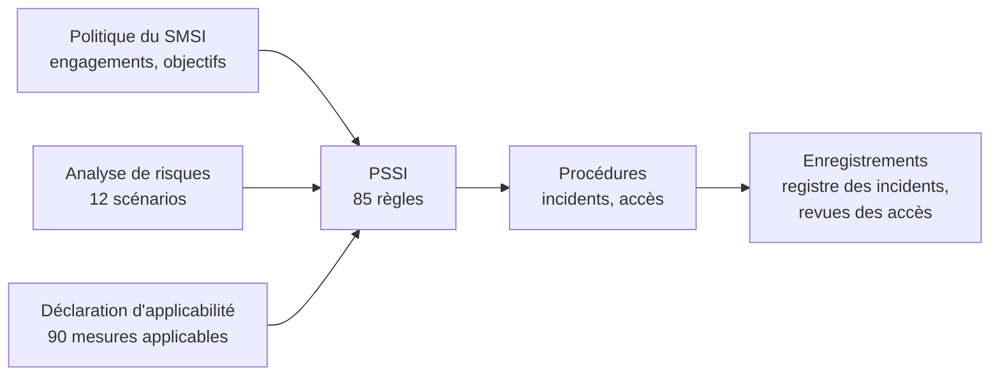

# PSSI et procédures

Ce dossier contient les règles de sécurité de NotAge et deux procédures opérationnelles.

| Document | Référence | Contenu |
|---|---|---|
| [PSSI (PDF, 12 pages)](PSSI-NotAge-v1.0.pdf) · [version Word](PSSI-NotAge-v1.0.docx) | NTG-SMSI-PSSI-001 | 12 sections, 85 règles identifiées, chacune reliée aux mesures de l'annexe A qu'elle met en œuvre |
| [Procédure de gestion des incidents](01-procedure-gestion-incidents.md) | NTG-SMSI-PRC-001 | Grille de gravité P1 à P4, déroulé en sept étapes, délais de notification, fiches réflexes |
| [Procédure de gestion des accès](02-procedure-gestion-acces.md) | NTG-SMSI-PRC-002 | Arrivées, mobilités, départs, comptes à privilèges, revue trimestrielle des accès |

## Comment la PSSI s'articule avec le reste du SMSI

- **Politique du SMSI.** La PSSI décline ses engagements en règles concrètes.
- **Déclaration d'applicabilité.** Chaque mesure applicable de la DdA renvoie à la section de la PSSI qui la met en œuvre.
- **Analyse de risques.** L'annexe de la PSSI montre quelles règles traitent chacun des 12 scénarios de risque.
