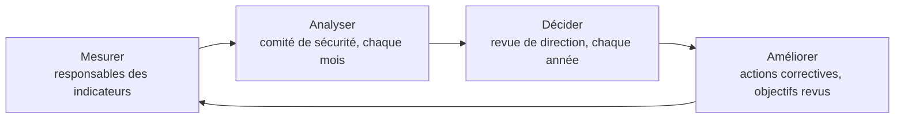

# Objectifs et indicateurs de sécurité

| Référence | Version | Date | Propriétaire | Approbateur | Classification | Statut |
|---|---|---|---|---|---|---|
| NTG-SMSI-PIL-001 | 1.0 | 27/09/2026 | RSSI | Direction générale (CEO) | Interne | Approuvé |

Exigences couvertes : ISO/IEC 27001:2022, articles 6.2, 9.1 et 9.3. Fichier de suivi : [`tableau-de-bord-indicateurs.xlsx`](tableau-de-bord-indicateurs.xlsx).

## 1. Objet

Ce document traduit les six objectifs de la [politique du SMSI](../01-gouvernance/02-politique-smsi.md) en indicateurs mesurables. Il précise aussi comment ces indicateurs sont mesurés, analysés et utilisés par la direction. Il répond à deux questions qu'un auditeur pose toujours :

- **Le SMSI atteint-il ses objectifs ?** C'est l'article 6.2.
- **Comment le sait-on ?** C'est l'article 9.1.

## 2. Des objectifs aux actions

L'article 6.2 demande de préciser, pour chaque objectif, ce qui sera fait, avec quelles ressources, par qui, pour quand, et comment les résultats seront évalués.

| Objectif | Cible | Ce qui sera fait | Responsable | Échéance | Indicateurs |
|---|---|---|---|---|---|
| **O1** Obtenir la certification ISO/IEC 27001 | Audit initial réussi au 3e trimestre 2027 | Mise en œuvre du plan de traitement et des mesures de la DdA ; audit interne ; revue de direction | RSSI | 30/06/2027 | I01, I02 |
| **O2** Protéger les données confiées | Aucune violation de données due à un défaut de sécurité de NotAge | Correction des vulnérabilités, sécurisation du stockage cloud, gestion des accès | CTO | 31/03/2027 | I03, I04, I05 |
| **O3** Garantir la disponibilité du service | Disponibilité mensuelle d'au moins 99,9 % | Sauvegardes immuables, tests de restauration, plan de reprise, gel des mises en production pendant les clôtures | CTO | 31/03/2027 | I06, I07, I08 |
| **O4** Prévenir la fraude aux coordonnées bancaires | 100 % des modifications d'IBAN sous contrôle renforcé | Double validation, notification des fournisseurs, détection des comportements anormaux | CFO | 31/12/2026 | I09, I10 |
| **O5** Faire de chaque salarié un acteur de la sécurité | 100 % des salariés sensibilisés chaque année | Sensibilisation à l'arrivée et annuelle, hameçonnage simulé trimestriel | RSSI | 31/12/2026 | I11, I12, I13 |
| **O6** Tenir les engagements envers les clients | 100 % des incidents notifiés aux clients dans les délais | Procédure de gestion des incidents, liste des délais contractuels par client | Responsable relation client | 31/12/2026 | I14 |

Les ressources correspondantes sont chiffrées dans le [plan de traitement des risques](../02-risques/04-plan-traitement.md). S'y ajoutent deux indicateurs de fonctionnement du SMSI lui-même (I15 et I16).

## 3. Tableau des indicateurs

Les valeurs sont celles mesurées en septembre 2026, au lancement du SMSI. Elles servent de référence pour suivre la progression.

| ID | Indicateur | Type | Cible | Échéance | Fréquence | Responsable | Valeur 09/2026 | Statut |
|---|---|---|---|---|---|---|---|---|
| I01 | Avancement du plan de traitement des risques | KPI | 100 % | 30/06/2027 | Mensuelle | RSSI | 0 % | 🔴 Sous la cible |
| I02 | Mesures applicables de la DdA mises en œuvre | KPI | ≥ 90 % | 30/06/2027 | Trimestrielle | RSSI | 29 % (26 sur 90) | 🔴 Sous la cible |
| I03 | Violations de données imputables à un défaut de sécurité de NotAge | KRI | 0 | Permanent | Mensuelle | RSSI | 0 | 🟢 Atteint |
| I04 | Vulnérabilités critiques et élevées corrigées dans les délais | KPI | 100 % | 31/12/2026 | Mensuelle | CTO | — | ⚪ Non mesuré |
| I05 | Comptes désactivés le jour du départ | KPI | 100 % | 31/12/2026 | Trimestrielle | Responsable RH | — | ⚪ Non mesuré |
| I06 | Disponibilité mensuelle de la plateforme | KRI | ≥ 99,9 % | Permanent | Mensuelle | CTO | 99,82 % | 🔴 Sous la cible |
| I07 | Tests de restauration réussis | KPI | 100 % | 31/12/2026 | Trimestrielle | Responsable infrastructure | 0 % | 🔴 Sous la cible |
| I08 | Durée de reprise mesurée lors du test du plan de reprise | KPI | ≤ 4 h | 31/03/2027 | Annuelle | CTO | — | ⚪ Non mesuré |
| I09 | Modifications d'IBAN soumises à la double validation | KPI | 100 % | 31/12/2026 | Mensuelle | CFO | 0 % | 🔴 Sous la cible |
| I10 | Fraudes au changement d'IBAN abouties | KRI | 0 | Permanent | Mensuelle | CFO | — | ⚪ Non mesuré |
| I11 | Salariés sensibilisés au cours des 12 derniers mois | KPI | 100 % | 31/12/2026 | Trimestrielle | RSSI | 0 % | 🔴 Sous la cible |
| I12 | Taux de clic lors des campagnes d'hameçonnage simulé | KRI | ≤ 5 % | 30/06/2027 | Trimestrielle | RSSI | — | ⚪ Non mesuré |
| I13 | Taux de signalement lors des campagnes d'hameçonnage simulé | KPI | ≥ 60 % | 30/06/2027 | Trimestrielle | RSSI | — | ⚪ Non mesuré |
| I14 | Incidents notifiés aux clients dans les délais | KPI | 100 % | Permanent | Mensuelle | Responsable relation client | — | ⚪ Non mesuré |
| I15 | Revues trimestrielles des accès réalisées | KPI | 100 % | 31/12/2026 | Trimestrielle | RSSI | 0 % | 🔴 Sous la cible |
| I16 | Fournisseurs critiques évalués | KPI | 100 % | 30/06/2027 | Semestrielle | CFO | 0 % | 🔴 Sous la cible |

**Situation de départ : 1 indicateur atteint, 8 sous la cible, 7 non mesurés.**

C'est normal pour un SMSI qui démarre : le tableau de bord montre l'écart que le plan de traitement doit combler. Les indicateurs « non mesurés » deviennent mesurables à mesure que les procédures sont mises en œuvre.

> **KPI ou KRI ?**
>
> - Un **KPI** (indicateur de performance) mesure si une mesure ou un processus fonctionne. Exemple : le pourcentage de revues d'accès réalisées.
> - Un **KRI** (indicateur de risque) mesure l'évolution de l'exposition au risque. Exemple : le taux de clic lors des campagnes d'hameçonnage simulé.
>
> Les deux sont nécessaires : un processus peut être appliqué à 100 % sans que le risque baisse.

## 4. Méthode de mesure

L'article 9.1 demande de déterminer ce qui est mesuré, par quelle méthode, quand, par qui, ainsi que quand et par qui les résultats sont analysés. Les règles de NotAge sont les suivantes.

| Question | Règle chez NotAge |
|---|---|
| **Quoi ?** | Les 16 indicateurs du tableau, reliés aux objectifs, aux risques et aux règles de la PSSI |
| **Comment ?** | Une formule et une source fixes pour chaque indicateur, pour que les résultats soient comparables d'une période à l'autre. La formule détaillée de chaque indicateur figure dans le tableau de bord Excel. |
| **Quand ?** | Selon la fréquence indiquée : mensuelle, trimestrielle, semestrielle ou annuelle |
| **Par qui ?** | Le responsable de l'indicateur mesure ; la RSSI consolide le tableau de bord |
| **Analyse ?** | Chaque mois en comité de sécurité ; chaque année en revue de direction |
| **Preuves ?** | Les tableaux de bord successifs et leurs données sources sont conservés comme enregistrements, au moins trois ans |

Un indicateur sous la cible deux périodes de suite donne lieu à une analyse de cause et, si nécessaire, à une action corrective.

## 5. Calendrier de pilotage

| Échéance | Activité |
|---|---|
| Chaque mois | Comité de sécurité : indicateurs, avancement du plan de traitement, incidents |
| Novembre 2026 | Première campagne d'hameçonnage simulé ; premières mesures des indicateurs I12 et I13 |
| Décembre 2026 | Première revue trimestrielle des accès ; premier test de restauration |
| Avril 2027 | Audit interne par un prestataire externe |
| Mai 2027 | Première revue de direction |
| 3e trimestre 2027 | Audit initial de certification |

## 6. Revue de direction

La revue de direction (article 9.3) est présidée par le CEO et préparée par la RSSI. Elle a lieu au moins une fois par an. La première se tiendra en mai 2027, avant l'audit de certification.

| Éléments examinés (entrées) | Décisions attendues (sorties) |
|---|---|
| Suites données aux revues précédentes | Opportunités d'amélioration du SMSI |
| Évolution des enjeux internes et externes, et des attentes des parties intéressées | Besoins de changement du SMSI (périmètre, politique, objectifs) |
| Résultats des indicateurs et atteinte des objectifs | Ressources supplémentaires |
| Non-conformités, actions correctives, résultats d'audit | Acceptation des risques résiduels élevés |
| Retours des parties intéressées (clients, auditeurs) | |
| Résultats de l'appréciation des risques et avancement du plan de traitement | |

Le compte rendu de chaque revue est un **enregistrement** du SMSI, conservé au moins trois ans.
