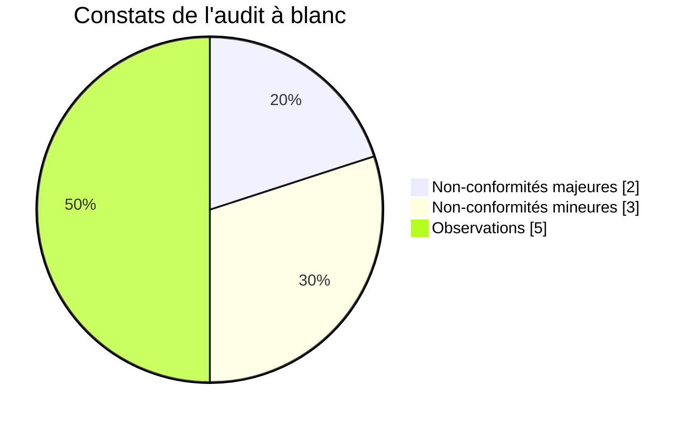

# Rapport d'audit à blanc — préparation à la certification

| Référence | Version | Date | Propriétaire | Approbateur | Classification | Statut |
|---|---|---|---|---|---|---|
| NTG-SMSI-AUD-001 | 1.0 | 27/09/2026 | RSSI | Direction générale (CEO) | Confidentiel | Approuvé |

Référentiel : ISO/IEC 27001:2022 et son amendement 1:2024. Méthode inspirée des lignes directrices d'audit ISO 19011 et ISO/IEC 27007.

## 1. Synthèse

**Conclusion : le SMSI de NotAge est correctement conçu, mais il n'est pas encore prêt pour l'audit de certification.**

**Ce qui est acquis**

- La documentation exigée par la norme existe.
- Elle est cohérente et traçable du contexte jusqu'aux indicateurs.
- Sur le papier, les articles 4 à 6 sont satisfaits.

C'est l'équivalent d'une **étape 1 favorable**.

**Ce qui manque**

Le SMSI vient d'être approuvé : il n'a donc pas encore fonctionné. Si l'audit de certification avait lieu aujourd'hui, l'auditeur relèverait :

| Classement | Nombre | Constats |
|---|---|---|
| 🔴 Non-conformité majeure | 2 | NCM-01 audit interne, NCM-02 revue de direction |
| 🟠 Non-conformité mineure | 3 | NCm-01 sensibilisation, NCm-02 compétences, NCm-03 risques et opportunités du SMSI |
| 🔵 Observation | 5 | OBS-01 à OBS-05 |
| 🟢 Point fort | 5 | PF-01 à PF-05 |

Les deux non-conformités majeures sont **attendues à ce stade** : un SMSI ne peut pas avoir été audité ni revu par sa direction le jour de son approbation. Le plan d'actions de la section 7 lève l'ensemble des constats avant l'audit initial, visé au troisième trimestre 2027.

## 2. Cadre de l'audit

| Élément | Description |
|---|---|
| Objectif | Évaluer l'état de préparation à la certification et identifier ce qui bloquerait l'audit sur site (étape 2) |
| Périmètre | Périmètre du SMSI ([NTG-SMSI-CTX-003](../00-contexte/03-perimetre-smsi.md)), articles 4 à 10 de la norme, déclaration d'applicabilité v1.0 |
| Méthode | Revue de l'ensemble de la documentation du SMSI ; contrôles de cohérence entre documents, dont une vérification automatisée de la correspondance entre la DdA et la PSSI ; examen des preuves de fonctionnement disponibles |
| Date | 27 septembre 2026 |
| Conduite | Auto-évaluation de préparation menée par la RSSI |

> **Ce rapport ne remplace pas l'audit interne.** L'article 9.2 exige des auditeurs objectifs et impartiaux. La RSSI, qui pilote le SMSI, ne peut donc pas réaliser l'audit interne. Celui-ci sera confié à un prestataire externe en avril 2027 (section 8). Cet audit à blanc sert à préparer l'organisation, pas à satisfaire l'article 9.2.

**Classement des constats**

| Classement | Définition |
|---|---|
| **Non-conformité majeure** | Une exigence n'est pas satisfaite, ou l'écart remet en cause la capacité du SMSI à atteindre ses résultats. Elle bloque la certification tant qu'elle n'est pas levée. |
| **Non-conformité mineure** | Écart ponctuel qui ne remet pas en cause le système. Il appelle une action corrective. |
| **Observation** | Pas d'écart à ce jour, mais un point de vigilance ou une piste d'amélioration. |
| **Point fort** | Pratique qui dépasse le niveau attendu. |

## 3. Matrice de conformité

Légende :

- ✅ conforme ;
- 🟡 conforme sur le papier, les preuves de fonctionnement restant à produire ;
- 🔴 non conforme à la date de l'audit.

| Article | Exigence | Preuves examinées | Résultat | Constat |
|---|---|---|---|---|
| 4.1 | Enjeux internes et externes, y compris le climat | CTX-001, CTX-002 | ✅ | — |
| 4.2 | Parties intéressées et exigences traitées par le SMSI | CTX-002 | ✅ | — |
| 4.3 | Périmètre documenté, interfaces et dépendances | CTX-003 | ✅ | PF-03 |
| 4.4 | Processus du SMSI et leurs interactions | CTX-003, section 5 | ✅ | — |
| 5.1 | Leadership et engagement de la direction | POL-001 approuvée, comité de sécurité, ressources du plan de traitement | ✅ | — |
| 5.2 | Politique de sécurité | POL-001 | ✅ | — |
| 5.3 | Rôles, responsabilités et autorités | GOV-001, matrice RACI | ✅ | — |
| 6.1.1 | Risques et opportunités du SMSI | RSK-001 à RSK-004 | 🔴 | NCm-03 |
| 6.1.2 | Appréciation des risques de sécurité | RSK-001, RSK-002, RSK-003 | ✅ | PF-01 |
| 6.1.3 | Traitement des risques et DdA | RSK-004, DDA-001 | ✅ | PF-02 |
| 6.2 | Objectifs de sécurité et leur planification | PIL-001 | ✅ | — |
| 6.3 | Planification des changements du SMSI | Aucun processus dédié | 🟡 | OBS-02 |
| 7.1 | Ressources | RSSI dédiée, budget et jours-homme du plan de traitement | ✅ | — |
| 7.2 | Compétences | Aucune définition des compétences requises ni preuve de compétence | 🔴 | NCm-02 |
| 7.3 | Sensibilisation | PSSI, section 4 ; indicateur I11 à 0 % | 🔴 | NCm-01 |
| 7.4 | Communication | Éléments épars (PSSI, PRC-001) | 🟡 | OBS-01 |
| 7.5 | Informations documentées | DOC-001, registre des documents, historique Git | ✅ | OBS-04, PF-05 |
| 8.1 | Planification et maîtrise opérationnelles, dont processus externalisés | PSSI, PRC-001, PRC-002 ; fournisseurs critiques non évalués | 🟡 | OBS-03 |
| 8.2 | Appréciation des risques réalisée et conservée | RSK-002, RSK-003 | ✅ | — |
| 8.3 | Traitement des risques mis en œuvre | RSK-004 approuvé ; mise en œuvre à démarrer (indicateur I01 à 0 %) | 🟡 | — |
| 9.1 | Surveillance, mesure, analyse et évaluation | PIL-001 et tableau de bord ; 7 indicateurs sur 16 pas encore mesurés | 🟡 | — |
| 9.2 | Audit interne | Aucun audit interne réalisé | 🔴 | NCM-01 |
| 9.3 | Revue de direction | Aucune revue de direction tenue | 🔴 | NCM-02 |
| 10.1 | Amélioration continue | Démarche prévue ; pas encore de preuve | 🟡 | — |
| 10.2 | Non-conformités et actions correctives | Actions correctives prévues dans plusieurs documents, sans processus unique | 🟡 | OBS-05 |

**Bilan** : sur 25 exigences, 13 sont conformes, 7 conformes sur le papier seulement et 5 non conformes à date.

## 4. Constats détaillés

Chaque constat est rédigé selon la structure d'un rapport d'audit :

- l'**exigence**, c'est-à-dire le critère d'audit ;
- ce qui a été **constaté** ;
- la **preuve** qui fonde le constat ;
- la **cause** de l'écart, lorsqu'elle est identifiée.

### NCM-01 — Aucun audit interne n'a été réalisé · 🔴 Non-conformité majeure

| | |
|---|---|
| Exigence | Article 9.2 : réaliser des audits internes à intervalles planifiés, selon un programme d'audit, avec des auditeurs objectifs et impartiaux |
| Constat | Aucun programme d'audit n'était approuvé et aucun audit interne n'a été réalisé |
| Preuve | Registre des documents : ni programme ni rapport d'audit interne |
| Cause | SMSI approuvé le 27 septembre 2026 ; aucun cycle de fonctionnement encore écoulé |

### NCM-02 — Aucune revue de direction n'a été tenue · 🔴 Non-conformité majeure

| | |
|---|---|
| Exigence | Article 9.3 : la direction revoit le SMSI à intervalles planifiés, sur la base des éléments d'entrée prévus par la norme, et en conserve les résultats |
| Constat | Aucune revue de direction n'a eu lieu ; les entrées et sorties sont définies (PIL-001, section 6) mais pas encore mises en œuvre |
| Preuve | Aucun compte rendu de revue de direction |
| Cause | Même cause que NCM-01 |

### NCm-01 — Les salariés ne sont pas encore sensibilisés · 🟠 Non-conformité mineure

| | |
|---|---|
| Exigence | Article 7.3 : les personnes travaillant pour l'organisation connaissent la politique de sécurité, leur contribution au SMSI et les conséquences d'un manquement |
| Constat | La PSSI est approuvée et s'applique à tous, mais aucune action de sensibilisation n'a encore eu lieu |
| Preuve | Indicateur I11 à 0 % ; aucune attestation de sensibilisation |
| Cause | Plan de sensibilisation défini (PSSI, section 4) mais pas encore lancé |

### NCm-02 — Les compétences requises ne sont pas définies · 🟠 Non-conformité mineure

| | |
|---|---|
| Exigence | Article 7.2 : déterminer les compétences nécessaires, s'assurer que les personnes sont compétentes, conserver des preuves de compétence |
| Constat | Les compétences attendues pour les rôles clés (RSSI, administrateurs, développeurs, support) ne sont pas définies, et aucune preuve de compétence n'est conservée |
| Preuve | Aucun référentiel de compétences ; formations prévues (RH-05) mais non tracées |
| Cause | L'exigence a été traitée sous l'angle de la sensibilisation, pas de la compétence |

### NCm-03 — Les risques et opportunités du SMSI lui-même ne sont pas déterminés · 🟠 Non-conformité mineure

| | |
|---|---|
| Exigence | Article 6.1.1 : déterminer les risques et opportunités à prendre en compte pour que le SMSI atteigne ses résultats, en tenant compte des enjeux (4.1) et des exigences (4.2) |
| Constat | L'appréciation des risques couvre les risques de sécurité de l'information (6.1.2), mais pas les risques et opportunités **du SMSI en tant que système de management**. Par exemple : la dépendance à une seule RSSI, ou la certification comme argument commercial. |
| Preuve | RSK-001 à RSK-004 : aucune mention des opportunités |
| Cause | Confusion fréquente entre l'article 6.1.1 et l'article 6.1.2 |

### Observations

| ID | Article | Observation |
|---|---|---|
| **OBS-01** | 7.4 | Les éléments de communication (quoi, à qui, quand, par qui, comment) sont dispersés entre la PSSI et la procédure d'incident. Un plan de communication unique faciliterait la démonstration à l'auditeur. |
| **OBS-02** | 6.3 | La norme de 2022 demande que les changements du SMSI soient planifiés. Aucun processus ne décrit comment un changement (nouveau périmètre, nouvelle réglementation comme NIS2) est préparé, validé et répercuté. |
| **OBS-03** | 8.1 | Le SMSI dépend de processus externalisés, au premier rang desquels l'hébergement chez AWS. Les fournisseurs critiques ne sont pas encore évalués (indicateur I16 à 0 %). L'auditeur de l'étape 2 demandera comment ces processus sont maîtrisés. |
| **OBS-04** | 7.5 | Le registre des documents a été mis à jour sans changement de version du document qui le contient, contrairement aux règles de ce même document. **Corrigé pendant l'audit** : le document passe en version 1.1 avec une règle explicite et un historique des versions. |
| **OBS-05** | 10.2 | Le traitement des non-conformités est évoqué dans plusieurs documents (PSSI, procédure d'incident, PIL-001) sans processus unique ni registre. Le plan d'actions de ce rapport tient lieu de premier registre. |

## 5. Points forts

| ID | Point fort |
|---|---|
| **PF-01** | **Traçabilité de bout en bout.** Chaque scénario de risque est relié à des mesures de l'annexe A, à des règles de la PSSI et à des indicateurs. La correspondance entre la DdA et la PSSI a été vérifiée automatiquement : les 90 mesures applicables sont couvertes. |
| **PF-02** | **Critères d'acceptation réellement appliqués.** Le risque résiduel élevé de R03 est assumé et accepté par écrit par la direction, au lieu d'être masqué par une cartographie entièrement verte. |
| **PF-03** | **Périmètre complet.** Toutes les activités sont incluses ; les exclusions portent uniquement sur ce que NotAge ne contrôle pas, suivi comme interfaces et dépendances. |
| **PF-04** | **Exigences des clients financiers intégrées.** Les délais de notification issus des contrats DORA priment explicitement sur les délais internes. |
| **PF-05** | **Maîtrise documentaire outillée.** L'historique Git fournit une preuve datée et attribuée de chaque modification. |

## 6. Préparer l'étape 2 : ce que l'auditeur échantillonnera

À l'étape 2, l'auditeur ne se contente plus de lire les documents. Il **prélève des échantillons** pour vérifier que les règles sont appliquées. Les preuves suivantes devront être disponibles.

| Exigence | Échantillon ou preuve attendue |
|---|---|
| 5.1 et 9.1 | Comptes rendus du comité de sécurité et tableaux de bord mensuels |
| 7.3 | Attestations de sensibilisation ; résultats des campagnes d'hameçonnage simulé |
| A.5.18 (ACC-09) | Extractions et validations des revues trimestrielles des accès |
| A.6.5 (PRC-002) | Pour un échantillon de départs : date de départ comparée à la date de désactivation des comptes |
| A.8.8 (EXP-05) | Pour un échantillon de vulnérabilités : date de détection comparée à la date de correction |
| A.8.13 (EXP-06) | Comptes rendus des tests de restauration trimestriels |
| A.8.32 (DEV-06) | Pour un échantillon de mises en production : revue, validation, plan de retour arrière |
| A.5.24 à A.5.27 | Registre des incidents ; retours d'expérience des incidents P1 et P2 |
| A.5.19 à A.5.22 | Évaluations des fournisseurs critiques ; clauses de sécurité des contrats |
| A.8.26 (DEV-02) | Journaux montrant la double validation des modifications d'IBAN |

## 7. Plan d'actions correctives

Ce tableau constitue le premier registre des non-conformités et des actions correctives de NotAge. Il est suivi chaque mois en comité de sécurité.

| Constat | Action | Responsable | Échéance | Preuve de clôture |
|---|---|---|---|---|
| NCM-01 | Approuver le programme d'audit interne (section 8) ; réaliser le premier audit interne avec un prestataire externe | RSSI (organisation), CEO (approbation) | 30/04/2027 | Programme approuvé, rapport d'audit interne |
| NCM-02 | Tenir la première revue de direction sur la base des entrées prévues par PIL-001 | CEO | 31/05/2027 | Compte rendu de revue de direction |
| NCm-01 | Sensibiliser 100 % des salariés ; lancer la première campagne d'hameçonnage simulé | RSSI, responsable RH | 31/12/2026 | Attestations ; indicateurs I11, I12, I13 |
| NCm-02 | Définir les compétences requises pour les rôles clés, planifier les formations, conserver les preuves | Responsable RH, RSSI | 31/01/2027 | Référentiel de compétences, attestations de formation |
| NCm-03 | Établir un registre des risques et opportunités du SMSI (par exemple : suppléance de la RSSI, automatisation des contrôles, valorisation commerciale de la certification) | RSSI | 30/11/2026 | Registre approuvé en comité de sécurité |
| OBS-01 | Formaliser un plan de communication de la sécurité | RSSI | 31/12/2026 | Plan de communication |
| OBS-02 | Décrire le processus de planification des changements du SMSI | RSSI | 31/12/2026 | Processus intégré à DOC-001 ou à un document dédié |
| OBS-03 | Évaluer AWS et les autres fournisseurs critiques | CFO, RSSI | 31/03/2027 | Évaluations ; indicateur I16 |
| OBS-04 | Corriger la règle de version du registre des documents | RSSI | 27/09/2026 | DOC-001 v1.1 — **clos** |
| OBS-05 | Rédiger la procédure de gestion des non-conformités et des actions correctives, avec son registre | RSSI | 30/11/2026 | Procédure approuvée, registre à jour |

## 8. Programme d'audit interne

L'article 9.2 demande un programme d'audit : sa fréquence, ses méthodes, ses responsabilités et ses rapports. Celui de NotAge couvre le cycle de certification de trois ans. Chaque exigence de la norme et chaque mesure applicable de la DdA sera auditée au moins une fois sur ce cycle.

| Période | Champ audité | Auditeur |
|---|---|---|
| Avril 2027 | Articles 4 à 10 ; les 28 mesures prioritaires du plan de traitement | Prestataire externe |
| Avril 2028 | Articles 9 et 10 ; mesures organisationnelles et liées aux personnes non encore auditées | Prestataire externe |
| Avril 2029 | Articles 9 et 10 ; mesures physiques et technologiques non encore auditées | Prestataire externe |

- **Rapport.** Les résultats de chaque audit sont présentés à la direction générale et versés aux entrées de la revue de direction.
- **Adaptation.** Le programme est ajusté après tout incident majeur ou changement significatif.

## 9. Conclusion

La conception du SMSI de NotAge répond aux exigences d'ISO/IEC 27001:2022. L'audit initial de certification est envisageable au troisième trimestre 2027, à trois conditions :

1. l'audit interne et la revue de direction ont eu lieu ;
2. les non-conformités mineures sont levées ;
3. le SMSI a fonctionné au moins trois mois avec des preuves disponibles : tableaux de bord, revues des accès, tests de restauration, registre des incidents.
