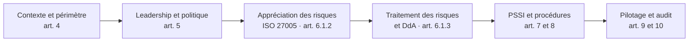
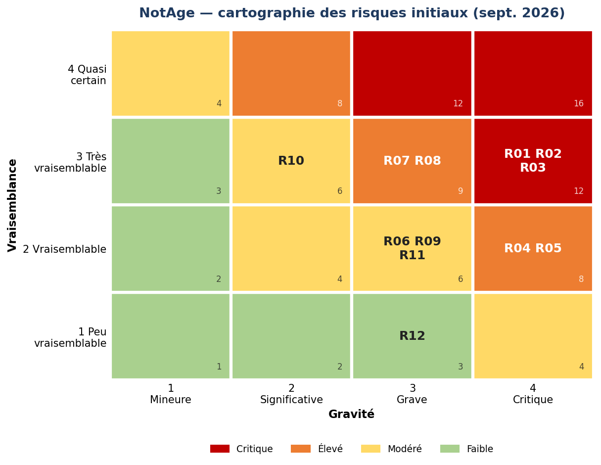
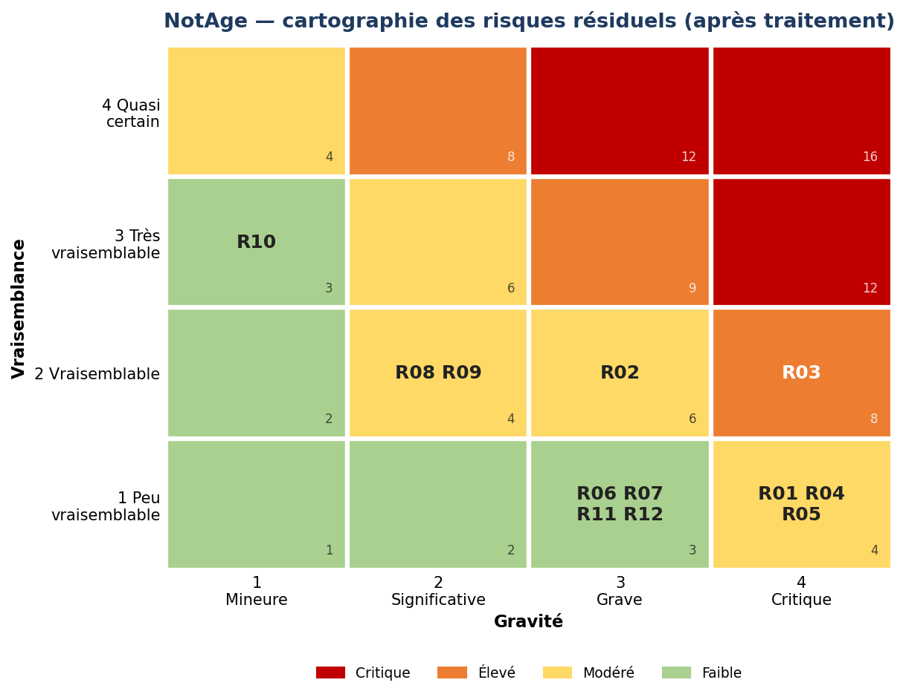

# SMSI ISO/IEC 27001:2022 — NotAge

Conception complète d'un système de management de la sécurité de l'information (SMSI) pour une startup SaaS B2B de 50 salariés : de l'analyse du contexte jusqu'à l'audit blanc de certification.

> NotAge est une **entreprise fictive**. Voir l'avertissement en bas de page.

## Le cas

NotAge édite une plateforme SaaS de gestion des notes de frais et des factures fournisseurs. Elle est hébergée sur AWS et utilisée par environ 350 entreprises, dont une dizaine d'établissements financiers.

Au renouvellement de son contrat, son premier client, une banque, exige deux choses :

- une **certification ISO/IEC 27001 sous 12 mois** ;
- une **annexe contractuelle issue du règlement DORA**.

Recrutée comme RSSI, je conçois le SMSI qui permettra d'y répondre.

## Démarche

Chaque livrable répond à une exigence précise de la norme. Le fil rouge relie chaque risque identifié à une mesure de l'annexe A, puis à une règle de la PSSI et à un indicateur de suivi.

## Chiffres clés

| | |
|---|---|
| Scénarios de risque analysés (ISO 27005) | **12** |
| Risques critiques avant → après traitement | **3 → 0** |
| Mesures de l'annexe A examinées dans la DdA | **93** (90 applicables, 3 exclusions justifiées) |
| Mesures prioritaires du plan de traitement | **28** |
| PSSI | **12 pages**, 12 sections, 85 règles reliées à l'annexe A |
| Pilotage | **16 indicateurs** (KPI et KRI) reliés aux 6 objectifs de la politique |
| Audit à blanc | 25 exigences évaluées, **10 constats** et 5 points forts, plan d'actions correctives |
| Documents maîtrisés du SMSI | Registre documentaire, versions, classification |

| Risques initiaux | Risques résiduels |
|---|---|
|  |  |

## Structure du dépôt

| Dossier | Contenu | Exigences |
|---|---|---|
| [`00-contexte`](00-contexte) | Présentation de l'entreprise, enjeux, parties intéressées, périmètre, actifs | 4.1 à 4.4 |
| [`01-gouvernance`](01-gouvernance) | Maîtrise documentaire, politique du SMSI, rôles et responsabilités | 5, 7.5 |
| [`02-risques`](02-risques) | Méthodologie, registre des risques, rapport d'analyse, plan de traitement | 6.1, 8.2, 8.3 |
| [`03-dda`](03-dda) | Déclaration d'applicabilité commentée des 93 mesures de l'annexe A | 6.1.3 d) |
| [`04-pssi`](04-pssi) | PSSI de 12 pages (PDF et Word), procédures de gestion des incidents et des accès | 5.2, 7.5, annexe A |
| [`05-pilotage-audit`](05-pilotage-audit) | Objectifs, 16 indicateurs et tableau de bord, rapport d'audit à blanc avec plan d'actions correctives | 6.2, 9, 10 |

## Avancement

| Étape | Statut |
|---|---|
| Cadrage et maîtrise documentaire | ✅ Terminé |
| Contexte, périmètre et gouvernance | ✅ Terminé |
| Appréciation des risques | ✅ Terminé |
| Traitement des risques et DdA | ✅ Terminé |
| PSSI et procédures | ✅ Terminé |
| Pilotage et audit à blanc | ✅ Terminé |
| Synthèse finale et présentation | 🔄 En cours |

## Références

- ISO/IEC 27001:2022 et son amendement 1:2024
- ISO/IEC 27002:2022
- ISO/IEC 27005:2022
- Guides de l'ANSSI
- Règlement (UE) 2022/2554 (DORA)
- RGPD

## Avertissement

- NotAge, ses clients, ses salariés et ses données sont **fictifs**. Toute ressemblance avec une entreprise existante serait fortuite.
- Les documents marqués « Interne » ou « Confidentiel » sont publiés ici **à titre de démonstration**.
- Les textes des normes ISO ne sont pas reproduits. Seuls les numéros et intitulés des mesures sont cités ; les descriptions sont rédigées avec mes propres mots.

## À propos

Projet réalisé par **Kevine Ines Nzenti**, élève ingénieure à l'Efrei (option cybersécurité, systèmes d'information et gouvernance).

Il a été initié dans le cadre d'un cours de sécurité des systèmes d'information, puis entièrement repris et approfondi individuellement.
