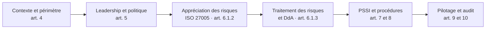
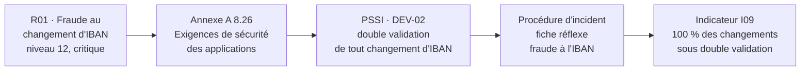

# SMSI ISO/IEC 27001:2022 — NotAge

Conception complète d'un système de management de la sécurité de l'information (SMSI) pour une startup SaaS B2B de 50 salariés : du contexte jusqu'à l'audit à blanc de certification.

> NotAge est une **entreprise fictive**. Voir l'avertissement en bas de page. · *English summary below.*

## Le cas

NotAge édite une plateforme SaaS de gestion des notes de frais et des factures fournisseurs. Elle est hébergée sur AWS et utilisée par environ 350 entreprises, dont une dizaine d'établissements financiers.

Au renouvellement de son contrat, son premier client, une banque, exige deux choses :

- une **certification ISO/IEC 27001 sous 12 mois** ;
- une **annexe contractuelle issue du règlement DORA**.

Recrutée comme RSSI, je conçois le SMSI qui permettra d'y répondre.

## Chiffres clés

| | |
|---|---|
| Scénarios de risque analysés (ISO 27005) | **12** |
| Risques critiques avant → après traitement | **3 → 0** |
| Mesures prioritaires du plan de traitement | **28** mesures de l'annexe A |
| Déclaration d'applicabilité | **93** mesures examinées (90 applicables, 3 exclusions justifiées) |
| PSSI | **12 pages**, 12 sections, 85 règles reliées à l'annexe A |
| Pilotage | **16 indicateurs** (KPI et KRI) reliés aux 6 objectifs de la politique |
| Audit à blanc | 25 exigences évaluées, **10 constats**, 5 points forts, plan d'actions correctives |

| Risques initiaux | Risques résiduels |
|---|---|
|  |  |

## Lire ce projet

**En 2 minutes**

1. Les chiffres clés et les deux cartographies ci-dessus.
2. La synthèse pour la direction du [rapport d'analyse de risques](02-risques/03-rapport-analyse-risques.md).
3. Le sommaire de la [PSSI (PDF)](04-pssi/PSSI-NotAge-v1.0.pdf).

**En 10 minutes**, ajouter :

4. Le [plan de traitement](02-risques/04-plan-traitement.md) : 12 scénarios, 28 mesures, risques résiduels.
5. La [déclaration d'applicabilité](03-dda/declaration-applicabilite.md) : 93 mesures justifiées.
6. Le [rapport d'audit à blanc](05-pilotage-audit/02-rapport-audit-blanc.md) : matrice de conformité et constats.

## Démarche

Chaque livrable répond à une exigence précise de la norme. Le fil rouge du projet est la **traçabilité** : chaque risque est relié à une mesure de l'annexe A, puis à une règle de la PSSI, à une procédure et à un indicateur. Exemple avec le risque le plus critique :

## Structure du dépôt

| Dossier | Contenu | Exigences |
|---|---|---|
| [`00-contexte`](00-contexte) | Présentation de l'entreprise, enjeux, parties intéressées, périmètre, actifs | 4.1 à 4.4 |
| [`01-gouvernance`](01-gouvernance) | Maîtrise documentaire, politique du SMSI, rôles et responsabilités | 5, 7.5 |
| [`02-risques`](02-risques) | Méthodologie, registre des risques, rapport d'analyse, plan de traitement | 6.1, 8.2, 8.3 |
| [`03-dda`](03-dda) | Déclaration d'applicabilité commentée des 93 mesures de l'annexe A | 6.1.3 d) |
| [`04-pssi`](04-pssi) | PSSI de 12 pages (PDF et Word), procédures de gestion des incidents et des accès | 5.2, 7.5, annexe A |
| [`05-pilotage-audit`](05-pilotage-audit) | Objectifs, 16 indicateurs et tableau de bord, rapport d'audit à blanc avec plan d'actions correctives | 6.2, 9, 10 |

## Compétences mobilisées

| Domaine | Mise en pratique dans le projet |
|---|---|
| Gouvernance | Structure ISO/IEC 27001:2022, politique, rôles et matrice RACI, maîtrise documentaire |
| Gestion des risques | Méthode ISO/IEC 27005:2022, critères d'acceptation, plan de traitement, acceptation des risques résiduels |
| Conformité | RGPD (sous-traitance), exigences contractuelles DORA des clients financiers, analyse d'applicabilité de NIS2 |
| Sécurité opérationnelle | Gestion des identités et des accès, gestion des incidents, sécurité du cloud AWS, développement sécurisé |
| Audit | Matrice de conformité, rédaction de constats, échantillonnage, programme d'audit interne |
| Outils | Excel (registres et tableaux de bord avec formules), Markdown et Mermaid, Git et GitHub |

## Évolutions prévues

Le projet vit comme un vrai SMSI : les prochaines versions lèveront les constats de l'[audit à blanc](05-pilotage-audit/02-rapport-audit-blanc.md).

- [ ] Registre des risques et opportunités du SMSI (article 6.1.1)
- [ ] Procédure de gestion des non-conformités et des actions correctives (article 10.2)
- [ ] Plan de communication de la sécurité (article 7.4)
- [ ] Procédures de sauvegarde et de continuité, et de gestion des fournisseurs
- [ ] Compte rendu simulé de la première revue de direction (article 9.3)

## English summary

This repository contains a complete **ISO/IEC 27001:2022 information security management system (ISMS)** designed for NotAge, a fictitious 50-employee B2B SaaS company handling expense reports and supplier invoices for about 350 clients, including banks bound by the EU **DORA** regulation. It covers:

- **Context and scope** (clauses 4 and 5).
- **Risk assessment** following **ISO/IEC 27005:2022**: 12 risk scenarios, of which 3 critical, reduced to none by a treatment plan of 28 Annex A controls.
- **Statement of Applicability** covering all 93 controls.
- **Information security policy** of 12 pages, with 85 rules mapped to Annex A.
- **Incident and access management procedures**.
- **Monitoring** with 16 KPIs and KRIs.
- **Mock certification audit** with a clause-by-clause conformity matrix and a corrective action plan.

Documents are written in French.

## Références

- ISO/IEC 27001:2022 et son amendement 1:2024
- ISO/IEC 27002:2022
- ISO/IEC 27005:2022
- ISO 19011 et ISO/IEC 27007 (lignes directrices d'audit)
- Guides et recommandations de l'ANSSI
- Règlement (UE) 2022/2554 (DORA) ; directive (UE) 2022/2555 (NIS2)
- Règlement (UE) 2016/679 (RGPD)

## Avertissement

- NotAge, ses clients, ses salariés et ses données sont **fictifs**. Toute ressemblance avec une entreprise existante serait fortuite.
- Les documents marqués « Interne » ou « Confidentiel » sont publiés ici **à titre de démonstration**.
- Les textes des normes ISO ne sont pas reproduits. Seuls les numéros et intitulés des mesures sont cités ; les descriptions sont rédigées avec mes propres mots.

## À propos

Projet réalisé par **Kevine Ines Nzenti**, élève ingénieure à l'Efrei (option cybersécurité, systèmes d'information et gouvernance).

Il a été initié dans le cadre d'un cours de sécurité des systèmes d'information, puis entièrement repris et approfondi individuellement (version 1.0, septembre 2026).
